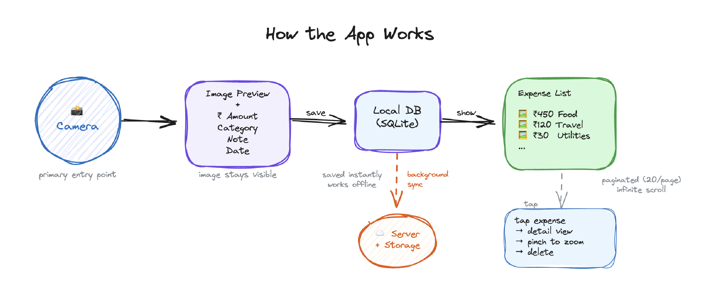
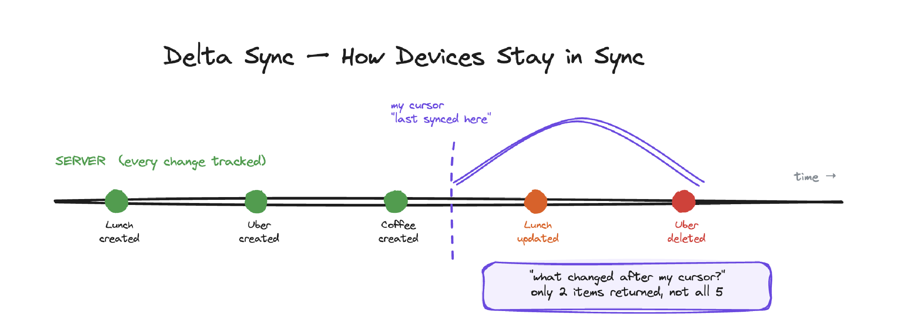
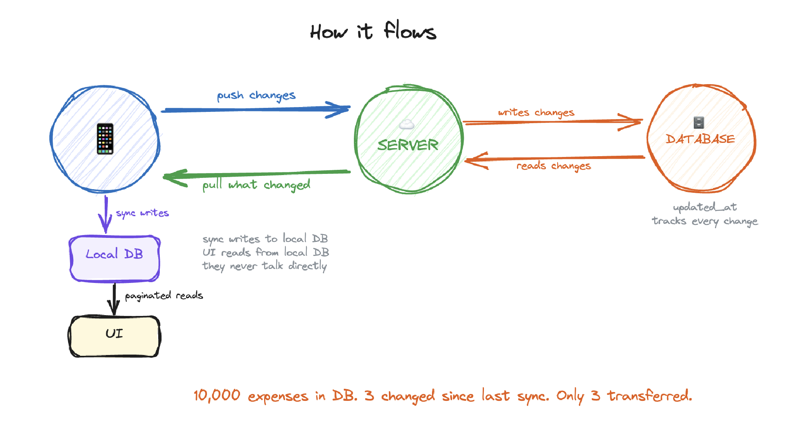
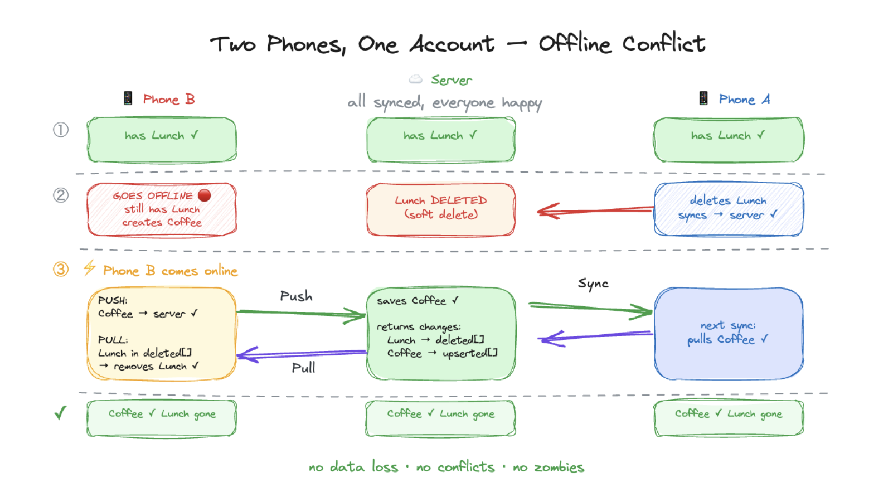

# Camera-First Expense Tracker

A Flutter mobile application that lets users capture expenses by photographing receipts. The camera is the primary entry point — point, shoot, tag, and move on.

## Live API

**Base URL:** `https://expense-tracker-production-2d65.up.railway.app`

## Architecture Diagrams

### How the App Works


### Delta Sync — How Devices Stay in Sync


### Sync Flow — Phone ↔ Server ↔ Database


### Multi-Device Offline Conflict Resolution


## Tech Stack

| Component | Technology | Why |
|-----------|-----------|-----|
| Mobile App | Flutter (Dart) | Cross-platform, single codebase |
| State Management | Riverpod v3 (Notifier) | Modern, testable, no boilerplate |
| Local Database | SQLite via Drift ORM | Type-safe queries, compile-time verification, offline-first |
| Backend | Node.js + Express | Lightweight, fast to build REST APIs |
| Database | PostgreSQL (Supabase) | Relational data, SQL aggregation for summaries, proper indexing |
| Image Storage | Supabase Storage | Integrated with DB, free tier, public URLs |
| Auth | Custom JWT (bcrypt + jsonwebtoken) | Full control over auth flow, portable |

### Why PostgreSQL over Firebase/Firestore?
Expenses are structured, relational data with a fixed schema. SQL gives powerful aggregation (`SUM`, `GROUP BY`) for the summary feature, and `WHERE` clauses with `ILIKE` for search. Firestore would require manual aggregation in application code.

### Why Drift over sqflite/Hive?
Drift provides type-safe queries with compile-time verification. Table definitions are Dart classes, not raw SQL strings. Migrations are handled automatically. It sits on top of sqflite (still SQLite underneath, as the assignment requires).

### Why Riverpod over Bloc/Provider?
Riverpod v3's Notifier pattern handles dependency injection cleanly via the `build()` method. No boilerplate, no context dependency, and `select()` enables granular widget rebuilds — so the summary bar doesn't re-render when only the expense list changes.

## Architecture

The app follows **Clean Architecture** with strict dependency rules:

```
lib/
├── core/               # DI container, constants, theme, error types
├── domain/             # Pure business logic (zero external dependencies)
│   ├── entities/       # ExpenseEntity, SummaryEntity
│   ├── repositories/   # Abstract interfaces (contracts)
│   └── usecases/       # One class per user action
├── data/               # Implementations
│   ├── models/         # ExpenseModel (extends entity, adds JSON/Drift conversions)
│   ├── datasources/    # LocalDatasource (Drift), RemoteDatasource (Dio)
│   └── repositories/   # Implements domain interfaces
├── database/           # Drift table definitions + generated code
└── presentation/       # UI layer
    ├── providers/      # Riverpod Notifiers (state management)
    ├── screens/        # Login, Signup, Home, Capture, Detail
    └── widgets/        # ExpenseCard, SummaryBar, EmptyState
```

**Dependency rule:** `Presentation → Domain ← Data`. Domain layer has zero package imports — it's pure Dart. Presentation never imports from the data layer. A DI container in `core/di.dart` wires everything together. This means I can swap Drift for Hive or Supabase for Firebase without changing any provider or use case code.

## Technical Decisions & Trade-offs

### Sync Strategy: Why Delta Sync with Cursor Pagination

I considered three approaches for syncing data between devices:

1. **Full sync** (pull everything on each sync) — simple but doesn't scale. With 10k expenses, every sync downloads 10k records.
2. **Timestamp-based delta sync** — client stores `lastSyncedAt`, asks server for changes after that timestamp. Only transfers what changed. This is what I built.
3. **Real-time WebSocket** — instant updates but significantly more complex. Overkill for an expense tracker where 60-second polling is acceptable.

The delta sync endpoint (`GET /expenses/changes?since=<timestamp>`) returns both `upserted` (new/updated) and `deleted` (soft-deleted IDs) in one response. This way the client knows what to add AND what to remove. The response is capped at 500 records with a `hasMore` flag for cursor pagination — I fetch one extra record (501) to detect if more pages exist, avoiding an expensive `COUNT(*)` query.

### Offline Concurrency: Handling Multi-Device Conflicts

The trickiest part was handling what happens when two devices modify data while offline. I ran into several edge cases:

**Problem 1: Device A deletes an expense, Device B (offline) still has it and tries to sync.**
My server's `POST /expenses` checks if the record exists with `deletedAt` set. If so, it returns the deleted record without recreating it — "dead stays dead." The client sees `deletedAt` in the response and removes it locally.

**Problem 2: Both devices delete the same expense.**
The `DELETE` endpoint is idempotent — it succeeds even if the expense is already deleted or doesn't exist. This prevents the pending delete queue from retrying forever.

**Problem 3: Device B pushes an expense while offline, but by the time it syncs, Device A already pushed the same data.**
The server uses `upsert` (`INSERT OR REPLACE`) so duplicate pushes update rather than fail. The `updated_at` field (auto-managed by Prisma's `@updatedAt`) ensures changes are always trackable.

### Pagination: Why the UI Reads from Local DB, Not Server

Early on, I had the UI fetching directly from the server for search/filter results. But for the main expense list, I made the UI read exclusively from the local SQLite database with paginated queries (`LIMIT 20 OFFSET n`). The sync engine writes to the DB in the background, then signals the UI to reload.

This separation means:
- **Instant first load** — reads from local DB, no network wait
- **Offline works** — same code path online and offline
- **No flicker** — sync writes to DB silently, UI only reloads if data actually changed (equality check on the list)
- **Scroll position preserved** — after sync, I reload the same number of items the user has scrolled to

For first-time login (empty local DB), I fetch page 1 directly from the server for instant display, while the full sync populates the DB in the background.

### Summary Bar: Server-Side vs Client-Side Aggregation

I initially calculated today/week/month totals on the client by iterating over all expenses in memory. This doesn't scale — with 100k expenses, that's 200MB loaded just for three numbers.

I moved this to a dedicated server endpoint (`GET /expenses/summary`) that runs three parallel `SUM()` queries with proper indexes. The client just receives three numbers. Offline, it shows the last known values.

### Preventing UI Flicker During Background Sync

Every 60 seconds, the sync runs in the background. Without care, this causes the list to flash/rebuild. I solved this with:

1. **Equality check** — `ExpenseEntity` has a custom `==` operator. After reloading from DB, I compare the new list with the current list item by item. If identical, I skip the state update entirely — Riverpod never notifies the UI.

2. **Granular widget watching** — Using Riverpod's `select()`, the `SummaryBar` only watches `state.summary`, and the `_ExpenseList` only watches `state.expenses`. When only the summary changes, the expense list doesn't rebuild.

3. **`_isSyncing` lock** — prevents two sync operations from running concurrently, which could cause race conditions.

### Idempotent Operations

All write operations are designed to be safely retried:
- `POST /expenses` uses upsert — same expense can be pushed multiple times without duplicates
- `DELETE /expenses/:id` succeeds even if already deleted — no 404 errors on retry
- Pending delete queue — offline deletes are queued and processed on next sync, then removed from queue

### Filter/Search: Server-Side with Debounce

Search hits the server (`WHERE note ILIKE '%query%'`) rather than filtering locally. This scales to any dataset size since PostgreSQL handles the filtering with indexes. I added a 500ms debounce so typing "lunch" sends one request, not five. A version counter ensures stale search results (from slow requests) are discarded if a newer search has started.

When offline, it falls back to filtering local cached data.

### Database Indexing

I added composite indexes on frequently queried patterns:
- `(user_id, updated_at)` — delta sync queries
- `(user_id, date)` — list sorting and date-range filters
- `(user_id, deleted_at)` — filtering active vs soft-deleted

Without these, every query would full-table scan.

## API Endpoints

| Method | Endpoint | Description |
|--------|----------|-------------|
| POST | `/api/auth/signup` | Create account (email, password, name) |
| POST | `/api/auth/login` | Login, returns JWT |
| POST | `/api/expenses` | Create expense (multipart: image + metadata) |
| GET | `/api/expenses` | List expenses (paginated, filterable) |
| GET | `/api/expenses/summary` | Get spend totals (today/week/month) |
| GET | `/api/expenses/changes` | Delta sync — changes since timestamp |
| DELETE | `/api/expenses/:id` | Soft delete expense |

**Query params for GET /expenses:** `page`, `limit`, `category`, `search`

## Features

**Core:**
- Camera/gallery as primary action
- Receipt image preview while filling details
- Amount, category, note, date fields
- Scrollable expense list with thumbnails
- Detail view with receipt image
- Delete with confirmation dialog
- JWT authentication (signup/login)

**Sync & Offline:**
- Offline-first — works without internet
- Delta sync with cursor-based pagination
- Pending delete queue for offline deletes
- Auto-sync on connectivity change
- Cross-device sync with conflict resolution
- Idempotent operations (safe retries)
- Zombie prevention (deleted expenses can't be recreated)

**Bonus:**
- Summary bar (today/week/month) — server-side SQL aggregation
- Pinch-to-zoom on receipt images — frosted glass overlay with dynamic blur
- Search by note keywords — server-side with 500ms debounce
- Filter by category — server-side with pagination
- Infinite scroll pagination

## Running Locally

### Backend

```bash
cd backend
npm install
npx prisma generate
```

Create `.env`:
```
PORT=3000
DATABASE_URL="your_supabase_pooled_url"
DIRECT_URL="your_supabase_direct_url"
JWT_SECRET="your_jwt_secret"
SUPABASE_URL="your_supabase_project_url"
SUPABASE_SERVICE_KEY="your_supabase_service_key"
```

Push schema to database:
```bash
npx prisma db push
```

Start server:
```bash
npm run dev
```

### Flutter App

```bash
cd expense_tracker
flutter pub get
flutter pub run build_runner build
flutter run
```

Update `lib/core/constants.dart` with your backend URL if running locally.

### Prerequisites
- Node.js 18+
- Flutter 3.41+
- Supabase account (free tier)
- Supabase Storage bucket named `receipts` (public)

## What I Would Improve With More Time

- **Real-time sync** — WebSocket/SSE instead of 60s polling for instant cross-device updates
- **Batch sync API** — `POST /expenses/batch` to push multiple expenses in one request instead of N individual calls
- **Token refresh** — access + refresh token rotation so users don't get logged out after 7 days
- **Image optimization** — generate thumbnails server-side for the list view (currently loads full images)
- **CDN** — put a CDN in front of Supabase Storage for faster image delivery
- **Rate limiting** — protect auth endpoints from brute force attacks
- **Exponential backoff** — on failed sync retries instead of fixed intervals
- **Background sync** — via Workmanager when app is closed, not just when in foreground
- **Cache eviction** — auto-evict expenses older than 90 days from local DB to save storage
- **E2E tests** — integration tests for the sync flow and offline scenarios
